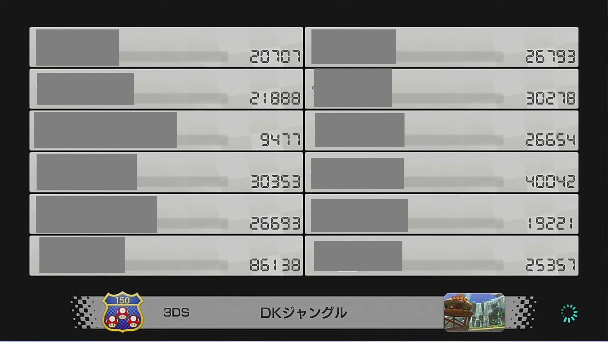

# mirror_200cc_analyer

マリオカートの8DXの野良レートのミラー率・200cc率を分析するためのツール群です。  
YouTubeのプレイ動画をダウンロードして、画像解析で各レースの情報を取得・集計しています。

<b>集計結果の例 https://docs.google.com/spreadsheets/d/1WAXeMbnZSGLMuhsiXlfcwdMkFvxd_VcAwz0979yXSVE/edit?usp=sharing </b>

<b>結論としては、ミラー率は10%, 200cc率は5%のようです。</b>

## セットアップ

PowerShell + Python 3.8.10 + CUDA11.8

```powershell
# python 3.8.10, CUDA Version 11.8
python -m pip install -U pip
python -m pip install -r ../requirements.txt
python -m pip install torch==1.7.1+cu110 torchvision==0.8.2+cu110 torchaudio==0.7.2 -f https://download.pytorch.org/whl/torch_stable.html
python -m pip install git+https://github.com/openai/CLIP.git
```

## YouTube動画のダウンロード

```
python download_youtube.py --target person0 --out_dir output/videos
```

成功すると、`output/vidoes/person0` 以下にダウンロードした動画が保存されます。  
`--target` にはダウンロード対象の配信者を指定してください。（READMEではperson0の例のみ記載）  
配信者・動画URLの一覧はdownload_youtube.py内で定義されています。  


## 参加者一覧画面の抽出

各レース前に表示される参加者一覧画面を各動画から抽出します。  

```
python playerlist_screens.py --video_dir output/videos/person0 --out_dir output/images
```

成功すると下のような画像が `output/images/person0` 以下に保存されます。



## レース詳細情報の取得

参加者一覧画面を画像解析して、レースの詳細情報を取得します。  

```
python race_information.py --img_dir output/images/person0 --out_dir output/race_information
```

成功すると `output/race_information/person0.csv` が出力されます。

具体的には以下を取得してCSV出力します。
- 種目（150cc/200cc/mirror）
- コース名
- 参加者のレート

合わせて、以下の情報もCSVに出力されます。
- 画像パス
- プレイ時期 (DLC0/DLC1/DLC2/DLC3)
    - DLC0: ~2022/3/17
    - DLC1: 2022/3/18~2022/8/4
    - DLC2: 2022/8/5~2022/12/7
    - DLC3: 2022/12/8~


## 集計

```
python count.py --race_info_dir output/race_information
```

成功すると、ミラー率, 200cc率の集計結果がコンソール出力されます。


```txt
# 出力例：
-----------------------
person0
-----------------------
[DLC3] 150cc: 11 (100.0%), mirror: 0 (0.0%), 200cc: 0 (0.0%), total: 11
[TOTAL] 150cc: 11 (100.0%), mirror: 0 (0.0%), 200cc: 0 (0.0%), total: 11
-----------------------
person0_full
-----------------------
[DLC0] 150cc: 28 (96.6%), mirror: 0 (0.0%), 200cc: 1 (3.4%), total: 29
[DLC1] 150cc: 187 (85.4%), mirror: 24 (11.0%), 200cc: 8 (3.7%), total: 219
[DLC2] 150cc: 138 (77.5%), mirror: 26 (14.6%), 200cc: 14 (7.9%), total: 178
[DLC3] 150cc: 149 (85.1%), mirror: 17 (9.7%), 200cc: 9 (5.1%), total: 175
[TOTAL] 150cc: 502 (83.5%), mirror: 67 (11.1%), 200cc: 32 (5.3%), total: 601
-----------------------
person1_full
-----------------------
[DLC1] 150cc: 264 (87.1%), mirror: 26 (8.6%), 200cc: 13 (4.3%), total: 303
[DLC0] 150cc: 197 (85.3%), mirror: 22 (9.5%), 200cc: 12 (5.2%), total: 231
[DLC2] 150cc: 159 (84.6%), mirror: 22 (11.7%), 200cc: 7 (3.7%), total: 188
[DLC3] 150cc: 153 (86.0%), mirror: 21 (11.8%), 200cc: 4 (2.2%), total: 178
[TOTAL] 150cc: 773 (85.9%), mirror: 91 (10.1%), 200cc: 36 (4.0%), total: 900
-----------------------
person2_full
-----------------------
[DLC2] 150cc: 473 (83.4%), mirror: 61 (10.8%), 200cc: 33 (5.8%), total: 567
[DLC3] 150cc: 478 (86.4%), mirror: 52 (9.4%), 200cc: 23 (4.2%), total: 553
[TOTAL] 150cc: 951 (84.9%), mirror: 113 (10.1%), 200cc: 56 (5.0%), total: 1120
-----------------------
person3_full
-----------------------
[DLC0] 150cc: 710 (86.3%), mirror: 70 (8.5%), 200cc: 43 (5.2%), total: 823
[DLC1] 150cc: 237 (83.7%), mirror: 31 (11.0%), 200cc: 15 (5.3%), total: 283
[DLC2] 150cc: 239 (86.0%), mirror: 24 (8.6%), 200cc: 15 (5.4%), total: 278
[DLC3] 150cc: 222 (85.1%), mirror: 21 (8.0%), 200cc: 18 (6.9%), total: 261
[TOTAL] 150cc: 1408 (85.6%), mirror: 146 (8.9%), 200cc: 91 (5.5%), total: 1645
-----------------------
ALL
-----------------------
[DLC0] 150cc: 935 (86.3%), mirror: 92 (8.5%), 200cc: 56 (5.2%), total: 1083
[DLC1] 150cc: 688 (85.5%), mirror: 81 (10.1%), 200cc: 36 (4.5%), total: 805
[DLC2] 150cc: 1009 (83.3%), mirror: 133 (11.0%), 200cc: 69 (5.7%), total: 1211
[DLC3] 150cc: 1013 (86.0%), mirror: 111 (9.4%), 200cc: 54 (4.6%), total: 1178
[TOTAL] 150cc: 3645 (85.2%), mirror: 417 (9.7%), 200cc: 215 (5.0%), total: 4277
```